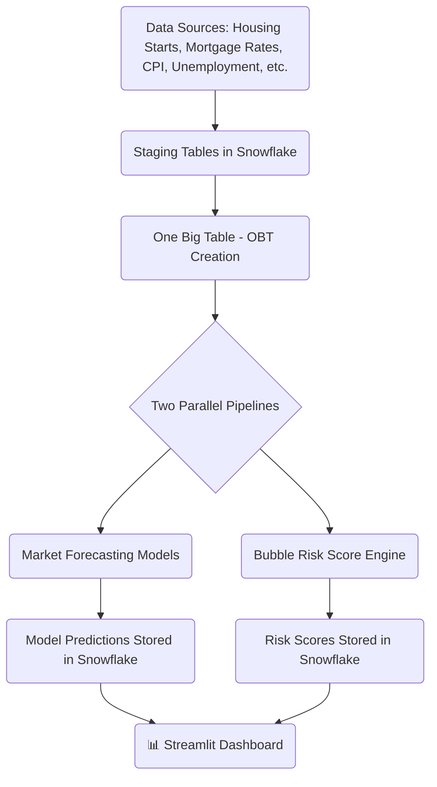

# 🏠 Housing Market Collapse Analysis & Risk Detection

> **A project to predict housing prices, detect potential bubbles, and assess market risks using Snowflake, Streamlit, and Machine Learning.**

---

## 🎯 Project Objective

The objective of this project is to **analyze, forecast, and monitor the U.S. housing market** by:

- Predicting changes in the **Housing Price Index** using machine learning models (Linear Regression, Ridge, Lasso).
- Detecting early warning signs of **housing bubbles** before potential market crashes.
- Building a **risk scoring system** based on housing prices, mortgage rates, and macroeconomic indicators.
- Delivering an **interactive Streamlit dashboard** to visualize trends, risks, and predictions.

Ultimately, the goal is to **empower users** (analysts, students, professors) with data-driven insights to better understand housing market dynamics.

---

## 🛠️ Tech Stack

- **Snowflake** (Data Warehousing)
- **Streamlit** (Dashboard & Visualization)
- **Python** (Data Cleaning, Modeling, and Deployment)
- **dbdiagram.io** (ERD Visualization)

---

## 🗺️ Project Architecture Overview



- **Data Sources**: Multiple quarterly datasets related to housing, macroeconomics, and mortgage trends.
- **Staging Layer**: Loaded and cleaned raw files into Snowflake staging tables.
- **OBT Creation**: Built a unified housing_market_quarterly_combined table joining all key inputs.
- **Pipeline Split**:
  - Market Forecasting → Predict future price indices.
  - Bubble Risk Detection → Score economic bubble risks.
- **Snowflake Storage**: Predicted values and risk scores written back to Snowflake.
- **Visualization**: Streamlit dashboard for user-friendly insights.

---

## 🗂️ Data Flow

1. **Housing Starts**, **Mortgage Rates**, **CPI**, **Unemployment**, and **Home Prices** staged separately.
2. **Joined and merged into a single OBT** based on the quarter.
3. **Features engineered** for modeling: lag features, moving averages, correlations.
4. **Walk-forward simulation** used to train forecasting models — **mimicking real-world prediction scenarios**.
5. **Bubble risk scores** calculated based on key indicators.
6. **Results visualized** via an interactive Streamlit dashboard.

---

## 🧠 Key Features

- 📈 **Price Prediction**: Forecast quarterly housing prices using machine learning models.
- 🔁 **Walk-Forward Simulation**: Models are trained with a rolling window approach to reflect real-world deployment, not just random splits.
- 💥 **Bubble Detection**: Identify periods of high-risk based on annual growth, deviation, momentum, and mortgage sensitivity.
- 📊 **Streamlit Dashboard**: Easily explore historical trends, future predictions, and live risk scores.
- ❄️ **Snowflake-Powered**: All data pipelines run on Snowflake — scalable, efficient, cloud-native.

---

## 📊 Models Used

| Model                 | Purpose                              |
|-----------------------|--------------------------------------|
| Linear Regression     | Baseline model for price prediction |
| Ridge Regression      | Regularized model to avoid overfitting |
| Lasso Regression      | Feature selection and sparse modeling |

---

## 🚨 Bubble Risk Scoring System

| Indicator                              | Scoring Logic  | Max Points |
|----------------------------------------|----------------|------------|
| 📈 Annual Price Growth                | >20% ➔ +30 pts | 30         |
| 📏 Deviation from Long-Term Average    | >2σ ➔ +15 pts  | 15         |
| 🔥 Sustained Positive Momentum        | >3 quarters ➔ +15 pts | 15    |
| 💰 Mortgage Rate Correlation          | >0.8 ➔ +20 pts | 20         |

> **Higher scores** indicate a **potential housing bubble** forming!

---

## 🚀 How to Run Locally

1. Clone the repo:
   ```bash
   git clone https://github.com/<your-username>/housing-market-collapse-model.git
   cd housing-market-collapse-model
   ```

2. Install dependencies:
   ```bash
   pip install -r requirements.txt
   ```

3. Set up your Snowflake connection (`snowflake_config.yaml`).

4. Run locally:
   ```bash
   streamlit run housing_main_dashboard.py
   ```

---

## 📚 Project Organization

```
housing-market-collapse-model/
│
├── config/                   # Snowflake config files
├── dashboard/                 # Optional dashboard assets
├── data/                      # Local data files if any
├── source/                    # All python scripts
│   ├── utils/                 # Utility functions (e.g., Snowflake connector)
│   ├── market_predictor.py    # Price forecasting pipeline
│   ├── bubble_detector.py     # Bubble detection and risk scoring
│   └── data_processor.py      # Staging and OBT creation
├── housing_main_dashboard.py  # Main Streamlit app
├── README.md                  # (You are here!)
└── requirements.txt           # Python dependencies
```

---

## 📌 Important Notes

- Streamlit deployment connects directly to Snowflake.
- Risk scores are recalculated quarterly — based on **new housing and macro data**.
- Walk-forward simulation ensures models mimic real-world production conditions, unlike random train-test splits.

---

## 🧑‍💻 Authors

- [Kapil Mahesh Tare](https://github.com/Kapil1917T)
- [Aadit Vikas Malikayil](https://github.com/aadit2697)

---

## 🌟 Acknowledgements

- Syracuse University – IST 722
- FRED Economic Data (Federal Reserve)
